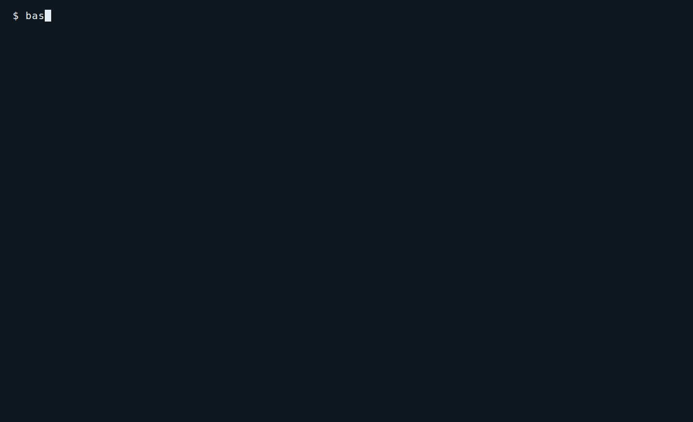
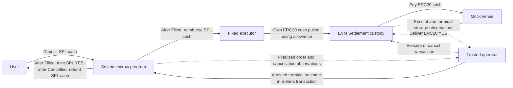

# Solana-to-EVM YES purchase settlement lab

[](https://github.com/MilosMicun/cross-chain-settlement-lab/actions/workflows/ci.yml)

A local Solana-to-EVM purchase settlement prototype: the user's deposit stays
in Solana escrow while a prefunded executor pays for the EVM purchase.
Confirmed operator-attested outcomes enable source settlement or refund.



Recorded interactive CLI execution with real local mock tokens and **separate
fresh deployments** for Filled and Cancelled recovery. **Operator and RPC are
trusted.** Running segments are genuine; most build/deployment/finality waits
are omitted with VHS `Hide`/`Show`. Results use the run's validated public evidence.

## What this demonstrates

- [Filled settlement](#verification): source YES issuance and executor reimbursement.
- [Confirmed cancellation](#verification): source refund with no YES issuance.
- [Cancellation races, atomic rollback and exact replay protection](#verification).
- [Recovery across fresh application processes](#verification) over running local nodes.

Existing local verification completed **32/32 full regression stages** and **17/17 offline
stages** on 2026-10-06; these are orchestration stages, not unique test totals.
The [verification map](#verification) links the checks to their source and separates
live local coverage from offline checks.

After completing the [setup prerequisites](#quick-start), run the interactive demo:

```bash
bash scripts/run-demo-ui.sh  # Arrow keys + Enter; E for evidence; Left/Right for results
```

## Money flow and responsibilities

The user deposit stays in Solana escrow; this implementation does not bridge
it. Source SPL cash and destination ERC20 cash are separate mock tokens. One
fixed executor supplies EVM cash through an allowance to Settlement and receives
the same cash amount in its configured Solana account after a fill. Purchased
EVM YES remains in Settlement custody, with no withdrawal path. Source YES is
a real mock SPL token representing that inventory, without a redemption
facility or promise. Delayed delivery ties up both escrow and executor liquidity.

There is one market, YES only, at **0.5 mock USD per YES**: 10 cash buys 20 YES.
All tokens use six decimals: `10_000_000` cash base units produce `20_000_000`
YES base units. The venue either fills completely and meets the user's minimum
output, or reverts. One trusted operator uses distinct Solana and EVM credentials;
the user signs deposit and cancellation intent, and the operator forwards and
attests outcomes.



Arrows show token actions, transactions and RPC observations over time. Solana
reimbursement and EVM spending use different assets; neither observations nor
attestations move the user's deposit between networks.

| Component | Implemented responsibility |
| --- | --- |
| [Rust/Anchor program](solana/programs/settlement_lab/src/lib.rs) | Account/PDA, mint and authority constraints; escrow deposits; cancellation intent; atomic SPL mint/reimbursement or refund; permanent identities and accounting. |
| [Solidity Settlement](evm/src/Settlement.sol) | Immutable configuration, executor cash spending, YES custody, checked accounting and permanent mutually exclusive terminal records. |
| [Mock venue](evm/src/mocks/MockVenue.sol) | Fixed price, prefunded YES inventory, full fill or revert with minimum output. |
| [TypeScript harness](harness/src/) | Request transport, configuration agreement, finalized source reads, destination confirmation, receipt delivery and recovery from chain state. |

## Execution, cancellation and recovery

The engineering problem is to prevent one order from receiving both source YES
and a source refund when execution, cancellation and delayed delivery compete.
EVM records move from `Unseen` to permanent `Filled` or `Cancelled`. Cancelling
an unseen order permanently blocks delayed execution. Cancellation of an
already filled order returns its stored Filled outcome.

On Solana, a user cancellation request changes `Pending` to `CancelRequested`
and keeps cash locked. A confirmed Filled outcome may still settle that order
as `Settled`, preserving its cancellation history. A confirmed Cancelled
outcome permits `Refunded` only after the user's request. Failed execution or
elapsed time alone never authorizes refund. Terminal outcomes are irreversible
and exclusive under the stated trust assumptions.

Exact accepted terminal replays have no additional economic effect; conflicting
terms or receipts fail. Solana token operations and accounting share a single
transaction and roll back together on failure, including reimbursement failure
after a successful mint CPI. EVM purchase and its terminal record are likewise
atomic within one EVM transaction. Canonical fixed-width encoding and SHA-256
agree across Solidity, Rust and TypeScript, including the
[golden vector](SPEC.md#complete-encodinghash-test-vector).

Fresh application processes can read finalized source state, rediscover the
original destination terminal transaction within a supplied bounded block range,
and deliver the missing outcome. After completion, another fresh process returns
`Complete` without further submissions. This is demonstrated worker behavior
over running local nodes. On-chain idempotency protects economic effects of
exact replays; it does not establish unrestricted exactly-once transport.

## Quick start

Use native x86_64 Linux (the observed host is Ubuntu/WSL2), Git, Bash, Python 3,
curl, tar, xz/bzip2, GNU coreutils, a C/C++ compiler and make. Demo and full
regression also need Linux `unshare`/`ip`, permission to create user/network
namespaces, and free runner-reserved ports. **Native Foundry 1.5.1 must already
be installed**; the installer does not install it. If it lives in
`~/.foundry/bin`, add that directory to PATH before setup.

Run from the repository root:

```bash
export PATH="$HOME/.foundry/bin:$PATH"
bash scripts/install-tools.sh
source scripts/env.sh
(cd harness && npm ci --ignore-scripts --no-audit)
bash scripts/check-tools.sh

bash scripts/run-demo.sh
bash scripts/check-regression.sh --offline
bash scripts/check-regression.sh
```

The installer selects repository-local pinned tools: Rust 1.99.0, Anchor 1.2.0,
Agave 4.1.2, SBF platform-tools v1.54, Node 24.21.0/npm 11.19.0 and Solidity
0.8.30. First-time installation and dependency preparation require downloads;
SBF platform-tools also use the upstream user cache. The demo and regression
wrappers build existing artifacts and never install tools themselves. Offline
mode launches no blockchain nodes, but still requires build dependencies and
caches; it does not guarantee network-free dependency resolution. On 2026-10-06,
installation/dependency preparation, **17/17 offline stages** and both demo
scenarios were verified from a clean local clone of `eca0709` on the existing
Ubuntu/WSL host, using existing native Foundry 1.5.1/system prerequisites and
the upstream SBF platform-tools cache. Full regression remains the previously
completed original-checkout run. This was not a fresh-machine, empty-cache,
CI, production deployment or production-finality test. See
[development setup](docs/development.md#setup-and-dependency-preparation) for details.

The demo runs Filled recovery and Cancelled recovery on **separate fresh
deployments**. The Filled scenario settles after the user's cancellation
request while retaining that history; the Cancelled scenario refunds after
destination cancellation. Successful terminal output includes each order ID,
original EVM terminal transaction hash, recovered outcome, finalized Solana
delivery signature/slot, `Settled` or `Refunded`, source balances and accounting
totals in integer base units, `Complete` with zero further submissions, and
verified cleanup.

Demo logs and `demo-summary.json` go to a new ignored `.runtime/demo-*`
directory; per-scenario evidence goes to the announced
`.runtime/dual-chain-setup-*` directories. Regression stage logs and
`regression-summary.json` go to `.runtime/regression-*`; build logs go to
`.local/logs/`. These are locally generated records, unavailable in a GitHub
checkout. Credentials remain separate ignored fixtures. There is no hosted demo.

<details>
<summary>Reproduce the recording</summary>

```bash
bash scripts/record-demo.sh # Reproduce the GIF from docs/demo.tape
```

Recording additionally requires optional [VHS](https://github.com/charmbracelet/vhs)
**0.12.1 or newer**, ttyd **1.7.2 or newer**, FFmpeg/ffprobe, Chrome/Chromium,
fontconfig and DejaVu Sans Mono, plus the demo prerequisites above.
These tools are separate from pinned protocol tooling; the recording wrapper
installs nothing and also searches ignored `.local/recording/bin`.
It preserves the original GIF, screenshots, terminal transcript, exact tool
versions and validation report in a new `.runtime/record-demo-*` directory,
alongside the CLI's current-run evidence. It replaces the embedded GIF only
after successful interactive completion, evidence/media checks and cleanup.
The embedded recording used VHS **0.12.1**, ttyd **1.7.7**, FFmpeg/ffprobe
**7.0.2**, Chrome for Testing **154.0.8037.92** and DejaVu Sans Mono at 20 px.

</details>

## Verification

The completed full regression covers builds/static checks, Rust host tests,
Foundry tests with fuzz/invariant checks, offline TypeScript tests and live
deployment, settlement, rollback, race, observation and recovery runners. The
separate offline result covers builds/static checks and host/offline tests only.
Both summaries report every required stage passed with exit code zero.

| Property | Tests or runner |
| --- | --- |
| Canonical bytes, bounds and SHA-256 golden vector | [Solidity](evm/test/ProtocolEncoding.t.sol), [Rust](solana/programs/settlement_lab/tests/protocol_encoding.rs), [TypeScript](harness/src/tests/protocol-encoding.test.ts) |
| EVM custody, full fill/revert, permanent cancellation and replay | [Execution](evm/test/SettlementExecution.t.sol), [cancellation](evm/test/SettlementCancellation.t.sol), [model invariant](evm/test/SettlementInvariant.t.sol), [accounting bounds](evm/test/SettlementAccountingBounds.t.sol) |
| Real Anchor authorization, account constraints, escrow and SPL payouts | [Initialization](harness/src/tests/initialization.test.ts), [creation](harness/src/tests/order-creation.test.ts), [Filled](harness/src/tests/filled-settlement.test.ts), [Cancelled](harness/src/tests/cancelled-settlement.test.ts); [Filled runner](scripts/check-solana-filled.sh), [Cancelled runner](scripts/check-solana-cancelled.sh) |
| Atomic failure, unchanged state, retry and replay | [Filled second-CPI rollback](harness/src/tests/filled-rollback.test.ts), [refund rollback](harness/src/tests/cancelled-rollback.test.ts); [Filled runner](scripts/check-solana-filled-rollback.sh), [refund runner](scripts/check-solana-cancelled-rollback.sh) |
| Cancellation races and failure without direct refund | [Execute wins](harness/src/tests/execute-wins.test.ts), [cancel and delayed execution](harness/src/tests/cancelled-delivery-live.test.ts), [failed execution then explicit cancellation](harness/src/tests/failed-execution-refund.test.ts) |
| Receipt/storage agreement and local EVM N+2 policy | [Live observation](harness/src/tests/terminal-observation-live.test.ts), [offline adversarial observation](harness/src/tests/terminal-observation.test.ts), [terminal discovery](harness/src/tests/terminal-discovery-live.test.ts) |
| Fresh-process recovery and completion without further writes | [Filled recovery](harness/src/tests/filled-recovery-live.test.ts), [Cancelled recovery](harness/src/tests/cancelled-recovery-live.test.ts), [demo wrapper](scripts/run-demo.sh) |
| Complete orchestration inventory and stage reporting | [Regression runner](scripts/check-regression.py), [dated local evidence summary](docs/development.md#current-verification-summary-2026-10-06) |

Tests check intermediate balances and state as well as terminal results. The
rollback deficit fixtures use **intentional genesis fault injection**; they
demonstrate atomic failure and retry, not an ordinary custody deficit or a
production recovery procedure. Rust host checks are separate from real
validator integration. Node parent tests and suites repeated by multiple runners
are not combined into a grand total. Detailed historical results remain in
[development records](docs/development.md#historical-verification-records).

### Offline CI

The [GitHub Actions workflow](.github/workflows/ci.yml) runs on pushes to `main`,
pull requests targeting `main`, and manual dispatch, on an Ubuntu 24.04 x86_64
runner. It invokes all **17 existing offline regression stages**, including
builds, locked Rust checks/tests, strict Forge lint, the existing fuzz/invariant
settings, and offline TypeScript suites. It launches no blockchain nodes and
does not cover validator integration, live cross-chain scenarios, or production
finality. The first [hosted run](https://github.com/MilosMicun/cross-chain-settlement-lab/actions/runs/37449467360)
completed successfully on **2026-10-06**, on Ubuntu 24.04, for commit
`23a06aca05347e366c404c3b8fdcb76ef1e0546a`: setup, all **17/17 offline
regression stages**, and report upload passed. The run's commit, successful
conclusion, job steps and logs were independently verified. This hosted offline
result remains separate from the locally verified live integration and
historical evidence above.

Run the same setup and regression entry point locally:

```bash
bash scripts/check-ci.sh
```

The entry point checks for at least 12 GiB of available repository disk space
before installation (later resource exhaustion can still fail the run), verifies
the pinned tools, and installs missing native Foundry **1.5.1** from an official
release asset pinned by asset ID and SHA-256 into ignored repository-local
storage. That verified asset reports `1.5.1-stable`, matching the existing tool
check; the `v1.5.1`-tagged archive reports `1.5.1-v1.5.1` and is not substituted.
It reuses `scripts/install-tools.sh`, `scripts/env.sh`, and
`npm ci --ignore-scripts --no-audit`; it refuses a mismatched selected Foundry
version. Setup requires downloads on a fresh runner; existing local caches do
not establish fresh-runner success. CI starts without dependency caching.

Each invocation announces an ignored `.runtime/ci-*/reports` directory with
selected public setup, version, dependency, build and stage logs and summaries,
including on failure. CI uploads only those selected report files with seven-day
retention, excluding wallets/keypairs, credentials, environment dumps, installed
tools and dependency caches. Cancellation or hard runner termination can prevent
final collection/upload.

## Trust and limitations

- The operator and RPC are trusted. Receipt hashes bind contents, not execution
  proofs. A dishonest operator can fabricate attestations and break backing;
  an unavailable operator can delay completion indefinitely. There is no atomic
  transaction across the two networks.
- Source observations use finalized Solana commitment. Destination observation
  requires a successful EVM receipt, matching terminal storage and two additional
  mined blocks. This local N+2 test policy is not production finality.
- Application-process recovery assumes both local nodes remain running. There
  is no machine/node restart, broadcast-crash or concurrent-worker guarantee.
- The pinned SBPF v0 program uses a disposable Agave genesis exception:
  SIMD-0500's `disable_sbpf_v0_v1_v2_deployment` feature is deactivated so genuine
  upgrade-authority removal can succeed. Results apply to that local feature
  set; see [the fixture explanation](docs/development.md#one-time-initialization-check).
- There is no production bridge, live venue integration, sell/redeem, public
  deployment, administrator refund override or runtime authority rotation.
  Tests are not an external security audit.

## Repository map

| Path | Contents |
| --- | --- |
| [SPEC.md](SPEC.md) | Protocol requirements, trust model, state transitions, bindings and encoding vectors. Its opening status identifies preserved historical implementation notes. |
| [solana/](solana/) | Anchor program, permanent accounts, checked accounting, SPL operations and Rust host tests. |
| [evm/](evm/) | Solidity Settlement, mock tokens/venue, unit, fuzz and invariant tests. |
| [harness/src/](harness/src/) | TypeScript transport, observations, recovery workers and offline/live tests. |
| [scripts/](scripts/) | Pinned local setup, isolated runners, demo and regression orchestration. |
| [docs/development.md](docs/development.md) | Environment, commands, current verification evidence and historical records. |

This is independent educational portfolio work, not commercial employment,
production ownership, audited software or a contribution to 4pto, Predikt or
LI.FI. The existing [public references in the specification](SPEC.md#purpose-and-scope)
establish relevance only; they imply no knowledge of product internals,
endorsement or integration with those systems.

This repository's original work is covered by the [MIT license](LICENSE).
Dependencies retain their own licenses.
